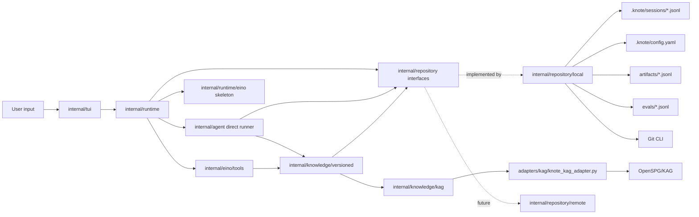

# Architecture

`knote` is a local-first TUI application with a small composition root and layered runtime boundaries:

1. `cmd/knote` parses CLI flags and wires concrete implementations.
2. `internal/tui` owns Bubble Tea projection and keyboard interaction.
3. `internal/runtime` owns session/thread lifecycle, event dispatch, task controls, confirm routing, and runner selection.
4. `internal/agent` owns the current direct turn handler: natural-language turns, slash commands, confirmations, tasks, and event persistence.
5. `internal/knowledge/versioned` owns versioned knowledge operations: build/query/explain/eval/diff/commit/release/checkout/status.
6. `internal/eino/tools` exposes the versioned knowledge service as shallow Eino `InvokableTool` adapters.
7. `internal/runtime/eino` is the Eino runner skeleton and tool inventory bridge. It is wired for inspection and future runner activation, but production turns still use the direct agent.
8. `internal/repository` defines workspace/session/version interfaces; `internal/repository/local` implements them with the local filesystem and Git CLI.
9. `internal/knowledge/kag` owns the OpenSPG/KAG boundary and Python NDJSON adapter subprocess.
10. `internal/repository/remote` is a future adapter skeleton for GitHub/Gitea/GitLab-style backends.

The TUI and agent are in the same Go binary. The KAG adapter remains a subprocess because OpenSPG/KAG is Python-native and has heavier environment requirements. The stable artifact contract is owned by knote, not by KAG.

## Dependency Flow

`internal/agent` depends only on `internal/knowledge/versioned`, `internal/repository`, `internal/protocol`, and the standard library. It does not import the local repository, KAG backend, Git wrapper, Python adapter, Eino tools, or TUI. `cmd/knote` is the composition root that creates `local.Store`, `kag.Client`, `versioned.Service`, Eino tools, the Eino runner skeleton, and `runtime.Manager`.

## Runtime Layers

`internal/runtime` is the interaction boundary for TUI now and Web later. It exposes start, message, confirm, interrupt, task stop, status, subscription, and runner info methods. Runtime owns the active session/thread state and fans emitted events to subscribers.

The default runner mode is `direct`. In this mode runtime delegates turns to `internal/agent`, preserving the current TUI behavior. `KNOTE_RUNTIME_MODE=eino` is an explicit development guard for the Eino skeleton; startup fails with a clear scaffolded-mode error until production turn execution is implemented.

`internal/runtime/eino` holds the Eino-facing runner skeleton. It can inventory registered tools and produce an ADK runner config from a future ADK agent. It does not own knowledge semantics and does not execute production turns yet.

`internal/eino/tools` is intentionally shallow. Each tool parses JSON arguments, calls `internal/knowledge/versioned`, and returns JSON. Mutating tools require a side-effect gate so they cannot bypass runtime confirmation.

## Agent And TUI

`internal/tui` owns screen projection only. It keeps the transcript, composer history, overlay state, and status line, then calls runtime methods for every user intent. It does not execute Git, artifact, KAG, Eino, or repository side effects directly.

`internal/agent` owns the direct-runner event stream. User messages become `message.user`; read-only commands return status, details, settings, versions, or diff events; side-effecting commands first emit `confirm.request`. Confirmed actions are validated against agent-owned pending confirmation state before they can run.

## Session Data

Each session is a JSONL event log under `.knote/sessions/<session-id>.jsonl`. `/clear` appends a `view.clear` event so the TUI projection resets without deleting history. `/new` creates a new session id and emits fresh `gateway.ready` and `session.info` events. `/resume <session-id>` loads the old event log, clears the projection boundary, and appends a new `session.info` event for the resumed session.

## Knowledge And KAG

`internal/knowledge/versioned` implements knote's versioned knowledge semantics:

- `/build` reads sources through `repository.Workspace`, calls `kag.Backend.Build`, normalizes results into knote artifact records, and writes an `ArtifactSet` through the repository.
- Natural-language query and explain prefer KAG, then fall back to stable local summaries when KAG is unavailable or empty.
- `/eval` reads questions through the repository, calls explain, writes stable eval results/report, and updates the knowledge hash used by the release gate.
- Version commands delegate to `repository.Versions`, so Git-backed local versions and future remote-backed versions share the same semantic facade.

`internal/knowledge` remains a compatibility shim over `internal/knowledge/versioned` while old imports are being removed.

`internal/knowledge/kag` talks to `adapters/kag/knote_kag_adapter.py` over newline-delimited JSON on stdio. Public methods are:

- `kag.health`
- `kag.build`
- `kag.query`
- `kag.explain`
- `kag.cancel`

Fake mode is selected with `KNOTE_KAG_FAKE=1` and returns deterministic responses for tests and local development. Real mode expects OpenSPG at `127.0.0.1:8887` by default and `openspg-kag` importable from `KNOTE_PYTHON`. KAG output is normalized into knote-owned artifacts before it becomes part of the public workspace contract.

## Local Repository

`internal/repository/local` implements the repository interfaces for the MVP:

- `.knote/config.yaml`
- `.knote/sessions/*.jsonl`
- `sources/`
- `artifacts/*.jsonl`
- `evals/*.jsonl`
- Git status, diff, log, commit, tag, and checkout

The artifact files are:

- `documents.jsonl`
- `chunks.jsonl`
- `entities.jsonl`
- `relations.jsonl`
- `claims.jsonl`
- `summaries.jsonl`
- `manifest.json`
- `schema.yaml`
- `build_report.md`

JSONL records are sorted by deterministic ids where applicable. Writes use temporary files and rename for atomic replacement. Runtime cache paths under `.knote/cache/`, `.knote/checkpoints/`, `.knote/kag-runtime/`, and `.knote/sessions/` are not knowledge artifacts.

## Remote Repository Skeleton

`internal/repository/remote` is intentionally not wired into `cmd/knote` for v0. It only models the future remote repository boundary and returns `repository.ErrRemoteNotImplemented` for every `Workspace`, `Sessions`, and `Versions` method.

The remote model does not simulate a local dirty working tree. It uses explicit remote concepts:

- base ref
- draft tree
- commit proposal
- pull or merge request
- tag or release

This keeps `internal/agent` stable: future remote implementations can make `/commit` create a branch commit or PR without changing TUI or agent command handling.

## Git And Release Gate

The local version implementation scopes version operations to `.knote/config.yaml`, `sources/`, `artifacts/`, and `evals/`. `/commit` stages only these paths. `/release` creates an annotated tag only after:

1. the workspace is clean, ignoring runtime-only session/cache files;
2. `evals/report.md` and `evals/results.jsonl` exist;
3. eval results have no adapter errors;
4. eval results are tied to the current knowledge hash.

The knowledge hash covers `.knote/config.yaml`, `sources/`, `artifacts/`, and `evals/questions.jsonl`, so post-eval knowledge changes make the release gate fail until `/eval` is rerun.
