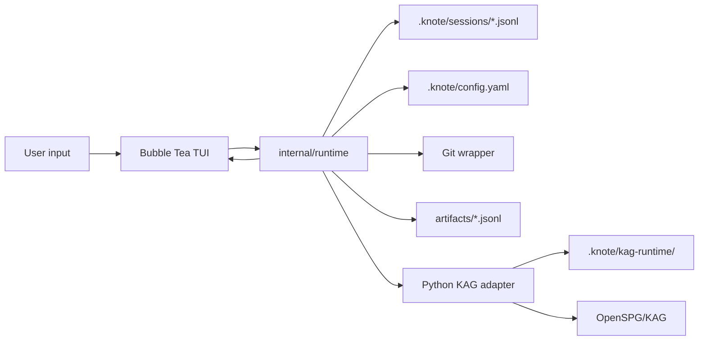

# Architecture

`knote` is a local-first TUI application with three runtime layers:

1. Go TUI (`internal/tui`)
2. Go runtime and tools (`internal/runtime`)
3. Python KAG adapter (`adapters/kag`)

The TUI and runtime are in the same binary for the MVP. The KAG adapter remains a subprocess because OpenSPG/KAG is Python-native and has heavier environment requirements.

The stable artifact contract is owned by knote, not by KAG.

## Runtime Flow

`internal/tui` owns screen projection only. It keeps the transcript, composer history, overlay state, and status line, then calls runtime methods for every user intent. It does not execute Git, artifact, or KAG side effects directly.

`internal/runtime` owns the event stream. User messages become `message.user`; read-only commands return status, details, settings, versions, or diff events; side-effecting commands first emit `confirm.request`. Confirmed actions are validated against runtime-owned pending confirmation state before they can run.

## Session Data

Each session is a JSONL event log under `.knote/sessions/<session-id>.jsonl`. `/clear` appends a `view.clear` event so the TUI projection resets without deleting history. `/new` creates a new session id and emits fresh `gateway.ready` and `session.info` events. `/resume <session-id>` loads the old event log, clears the projection boundary, and appends a new `session.info` event for the resumed session.

## KAG Boundary

The Go runtime talks to `adapters/kag/knote_kag_adapter.py` over newline-delimited JSON on stdio. Public methods are:

- `kag.health`
- `kag.build`
- `kag.query`
- `kag.explain`
- `kag.cancel`

Fake mode is selected with `KNOTE_KAG_FAKE=1` and returns deterministic responses for tests and local development. Real mode expects OpenSPG at `127.0.0.1:8887` by default and `openspg-kag` importable from `KNOTE_PYTHON`. KAG output is normalized into knote-owned artifacts before it becomes part of the public workspace contract.

## Artifact Contract

`internal/artifact` writes the stable files under `artifacts/`:

- `documents.jsonl`
- `chunks.jsonl`
- `entities.jsonl`
- `relations.jsonl`
- `claims.jsonl`
- `summaries.jsonl`
- `manifest.json`
- `schema.yaml`
- `build_report.md`

JSONL records are sorted by deterministic ids where applicable. Writes use temporary files and rename for atomic replacement. Runtime cache paths under `.knote/cache/`, `.knote/checkpoints/`, `.knote/kag-runtime/`, and `.knote/sessions/` are not knowledge artifacts.

## Git And Release Gate

`internal/gitstore` scopes version operations to `.knote/config.yaml`, `sources/`, `artifacts/`, and `evals/`. `/commit` stages only these paths. `/release` creates an annotated tag only after:

1. the workspace is clean, ignoring runtime-only session/cache files;
2. `evals/report.md` and `evals/results.jsonl` exist;
3. eval results have no adapter errors;
4. eval results are tied to the current knowledge hash.

The knowledge hash covers `.knote/config.yaml`, `sources/`, `artifacts/`, and `evals/questions.jsonl`, so post-eval knowledge changes make the release gate fail until `/eval` is rerun.
