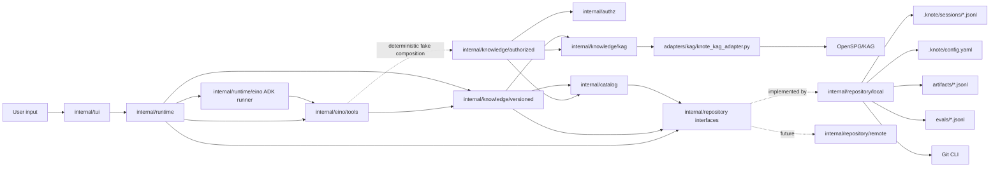
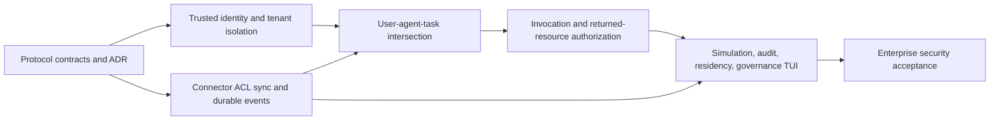

# Architecture

`knote` is a local-first TUI application with a small composition root and layered runtime boundaries:

1. `cmd/knote` parses CLI flags and wires concrete implementations.
2. `internal/tui` owns Bubble Tea projection and keyboard interaction.
3. `internal/runtime` owns Eino-only session/thread lifecycle, event dispatch, task controls, slash routing, confirm routing, and runner management.
4. `internal/knowledge/versioned` owns versioned build/query/explain/eval/diff/commit/release/checkout/status operations and projection builds.
5. `internal/knowledge/authorized` owns the authorization-aware query gateway, bounded Claim traversal, cache, citations, and revocation handling.
6. `internal/protocol` owns stable security and enterprise wire contracts; `internal/authz` owns local/OpenFGA authorization checks and model contracts; `internal/catalog` owns deterministic projection planning, immutable serving snapshots, and graph bindings.
7. `internal/eino/tools` exposes versioned and permissioned knowledge operations as shallow Eino `InvokableTool` adapters.
8. `internal/runtime/eino` is the Eino ADK runner bridge. It constructs an OpenAI-compatible `ChatModelAgent`, inventories knote tools, and projects ADK events back to knote events.
9. `internal/repository` defines workspace/session/version interfaces; `internal/repository/local` implements them with the local filesystem and Git CLI.
10. `internal/knowledge/kag` owns the OpenSPG/KAG boundary and Python NDJSON adapter subprocess.
11. `internal/repository/remote` is a future adapter skeleton for GitHub/Gitea/GitLab-style backends.

The TUI and runtime are in the same Go binary. The KAG adapter remains a subprocess because OpenSPG/KAG is Python-native and has heavier environment requirements. The stable artifact contract is owned by knote, not by KAG.

## Dependency Flow

```mermaid
flowchart LR
  User["User input"] --> TUI["internal/tui"]
  TUI --> Runtime["internal/runtime"]
  Runtime --> EinoRunner["internal/runtime/eino ADK runner"]
  Runtime --> EinoTools["internal/eino/tools"]
  Runtime --> RepoIf["internal/repository interfaces"]
  EinoRunner --> EinoTools
  EinoTools --> Versioned
  EinoTools -. deterministic fake composition .-> Authorized["internal/knowledge/authorized"]
  Runtime --> Versioned["internal/knowledge/versioned"]
  Authorized --> Authz["internal/authz"]
  Authorized --> Catalog["internal/catalog"]
  Authorized --> Kag
  Versioned --> Catalog
  Versioned --> RepoIf
  Catalog --> RepoIf
  Versioned --> Kag["internal/knowledge/kag"]
  Kag --> Adapter["adapters/kag/knote_kag_adapter.py"]
  Adapter --> OpenSPG["OpenSPG/KAG"]
  RepoIf -. implemented by .-> Local["internal/repository/local"]
  Local --> Sessions[".knote/sessions/*.jsonl"]
  Local --> Config[".knote/config.yaml"]
  Local --> Artifacts["artifacts/*.jsonl"]
  Local --> Evals["evals/*.jsonl"]
  Local --> Git["Git CLI"]
  RepoIf -. future .-> Remote["internal/repository/remote"]
```

`cmd/knote` is the composition root that creates `local.Store`, `kag.Client`, `versioned.Service`, Eino tools, the Eino runner, and `runtime.Manager`. When permissioned mode is enabled, the normal CLI selects the same authorization-aware application for deterministic fake mode and for the configured real primitive provider. `internal/runtime` does not import the local repository, KAG backend, Python adapter, or TUI.

## Runtime Layers

`internal/runtime` is the interaction boundary for TUI now and Web later. It exposes start, message, confirm, interrupt, task stop, status, subscription, and runner info methods. Runtime owns the active session/thread state, deterministic slash routing, pending side-effect confirmations, and event fanout.

The runtime is Eino-only. Ordinary user messages go through the Eino ADK `ChatModelAgent`; slash commands are routed deterministically by runtime to either local session/status behavior or knote Eino tools. Startup requires an OpenAI-compatible profile and API key from `.knote/config.yaml` plus environment overrides such as `KNOTE_EINO_PROVIDER`, `KNOTE_EINO_MODEL`, `KNOTE_EINO_API_KEY`, `KNOTE_EINO_BASE_URL`, and `KNOTE_EINO_REASONING_EFFORT`. `OPENAI_MODEL`, `OPENAI_API_KEY`, and `OPENAI_BASE_URL` are also accepted. `KNOTE_RUNTIME_MODE=direct` is rejected.

`internal/runtime/eino` holds the Eino-facing runner. It converts knote `InvokableTool` adapters into Eino base tools, constructs the OpenAI-compatible chat model, builds the ADK agent, executes turns through `adk.Runner`, and projects ADK tool/assistant/interrupt events into knote protocol events. It does not own knowledge semantics.

`internal/eino/tools` is intentionally shallow. Each tool parses JSON arguments, calls `internal/knowledge/versioned`, and returns JSON. Mutating tools require a side-effect gate so they cannot bypass runtime confirmation.

Eino side effects are bridged back through runtime confirmation instead of executing directly. In Eino mode, mutating tools call a `SideEffectGate`; runtime stores the pending request, emits one `confirm.request` at a time, and only executes the approved tool once after TUI approval. Queued confirmations are FIFO, request ids include a monotonic suffix, and adapter failures returned by approved tools are projected as `tool.error`/`error` rather than `tool.complete`.

The local OpenAI-compatible path is validated manually with `scripts/smoke_eino_local_proxy.sh`. That script probes `/v1/models`, starts the Eino-only TUI, requires a permissioned `knote_query` tool call, and waits for the evidence-bound `knote-authorized-ok` response. The smoke is intentionally manual because it depends on a local proxy and API key.

## Runtime And TUI

`internal/tui` owns screen projection only. It keeps the transcript, composer history, overlay state, and status line, then calls runtime methods for every user intent. It does not execute Git, artifact, KAG, Eino, or repository side effects directly.

`internal/runtime` owns the event stream. User messages become `message.user`; read-only slash commands return status, details, settings, versions, or diff events; side-effecting slash commands first emit `confirm.request`. Confirmed actions are validated against runtime-owned pending confirmation state before they can run.

## Session Data

Each session is a JSONL event log under `.knote/sessions/<session-id>.jsonl`. `/clear` appends a `view.clear` event so the TUI projection resets without deleting history. `/new` creates a new session id and emits fresh `gateway.ready` and `session.info` events.

Permissioned sessions pair the event log with a versioned `.authorization.json` metadata envelope. Resume fails closed before loading history when the envelope is missing or its tenant, knowledge base, principal, authorization model, identity/ACL watermarks, task scope, or consistency preference differs. Protected blocks are then reauthorized against current policy before replay; legacy, malformed, or denied protected content is not restored.

## Knowledge And KAG

`internal/knowledge/versioned` implements knote's versioned knowledge semantics:

- `/build` reads sources through `repository.Workspace`, calls `kag.Backend.Build`, normalizes results into knote artifact records, and writes an `ArtifactSet` through the repository.
- Natural-language query and explain prefer KAG, then fall back to stable local summaries when KAG is unavailable or empty.
- The versioned service retains eval/report and knowledge-hash semantics, but runtime rejects `/eval` because the legacy explain dependency is not a permissioned-query boundary. Evaluation must not be re-exposed until it consumes only authorized evidence.
- Version commands delegate to `repository.Versions`, so Git-backed local versions and future remote-backed versions share the same semantic facade.

`internal/knowledge` remains a compatibility shim over `internal/knowledge/versioned` while old imports are being removed.

`internal/knowledge/kag` talks to `adapters/kag/knote_kag_adapter.py` over newline-delimited JSON on stdio. Public methods are:

- `kag.health`
- `kag.build`
- `kag.query`
- `kag.explain`
- `kag.cancel`
- `kag.discover`
- `kag.retrieve`
- `kag.expand`
- `kag.generate`

The first five methods are legacy/build compatibility contracts. The complete real `kag.query` and `kag.explain` solver path is not a permissioned-query boundary: retrieval summaries, graph selectors, task memory, and intermediate LLM calls can observe content before the final answer returns.

The four permissioned primitives are the current authorized boundary. Discover returns a complete deterministic body-free resource catalog. Retrieve and expand return exact versioned resource handles without bodies, predicate labels, or relation text. Generate accepts only the already-authorized, digest-verified exact evidence set. `internal/knowledge/authorized.Service` owns `discover -> pre-ranking authorize -> retrieve -> per-hop authorize/expand -> exact load -> final authorize -> generate`; it never falls back to legacy `kag.query` or `kag.explain`.

Fake mode implements the boundary deterministically. Real mode validates the immutable graph bundle before loading an operator-configured provider. The provider can return only allowlisted opaque graph IDs for retrieve; expand traverses verified `claim_bindings.jsonl` one structural hop at a time; generate receives only validated evidence. Provider output cannot define resource metadata, citations, or trace membership. ADR 0002 records the interception decision, ADR 0003 defines graph identity, and ADR 0004 defines the real provider contract. These real primitives and the OpenFGA/OpenSPG path are smoke-tested through the same permissioned application selected by the normal CLI.

Each Go client call starts one adapter subprocess. Context cancellation or timeout terminates that subprocess through `exec.CommandContext` and returns the caller's context error after reaping it. Real provider calls run behind an isolated runner and guardian with process-group or descendant cleanup, Linux subreaping, and a Windows kill-on-close job so detached helpers cannot outlive cancellation. `kag.cancel` remains a compatibility acknowledgement for its own one-request process and cannot interrupt another call.

Fake mode is selected with `KNOTE_KAG_FAKE=1` and returns deterministic responses for tests and local development. Legacy real build/query/explain expects OpenSPG at `127.0.0.1:8887` by default and `openspg-kag` importable from `KNOTE_PYTHON`. Real permissioned primitives additionally require `KNOTE_KAG_PERMISSIONED_PROVIDER=module:factory` and a current immutable graph bundle. KAG build output is normalized into knote-owned artifacts before it becomes part of the public workspace contract.

## Authorization, Projection, And Revocation

`internal/catalog` plans complete replacement projections and publishes only immutable snapshots whose content, ACL, index, and graph identities agree. The selected bundle is the sole serving identity authority; OpenSPG IDs, labels, snippets, solver traces, and caller-supplied DSL are not trusted as bindings.

`internal/authz` batches authorization decisions through a strict fail-closed contract. `internal/knowledge/authorized` authorizes the body-free catalog before ranking, authorizes each traversal frontier and Claim/object hop, validates exact content digests before use, and authorizes the final path/evidence set before generation. Denied or cross-tenant resources cannot participate in relevance, traversal, exact load, generation, traces, or citations.

Authorized cache keys bind visibility, execution, traversal, projection, identity, and ACL state; cache hits are live-revalidated. Revocation installs permanent tombstones before further authorization, blocks in-flight repopulation, and closes future cache, citation, and protected-session replay. This cannot retract content that a user already viewed or copied.

## Enterprise Control And Data Plane

ADR 0005 defines the Phase 3 contracts before provider-specific implementations land. `internal/protocol` now models tenant scope, normalized identity snapshots, durable connector events and checkpoints, delivery receipts and tombstones, exact agent/task delegation, tool invocation and result obligations, read-only policy simulation, impact records, audit-chain references, and regional residency checks.

The enterprise control plane contains only tenant-scoped, content-free metadata and digests. Protected source bodies, graph text, prompts, answers, assertions, and credentials remain in the tenant data plane. Tenant is the root partition for identities, connectors, projections, checkpoints, DLQs, serving pointers, caches, sessions, and audit chains.

Phase 3 implementations follow this dependency flow:

```mermaid
flowchart LR
  Contracts["Protocol contracts and ADR"] --> Identity["Trusted identity and tenant isolation"]
  Contracts --> Connector["Connector ACL sync and durable events"]
  Identity --> Agent["User-agent-task intersection"]
  Connector --> Agent
  Agent --> Tools["Invocation and returned-resource authorization"]
  Tools --> Governance["Simulation, audit, residency, governance TUI"]
  Connector --> Governance
  Governance --> Acceptance["Enterprise security acceptance"]
```

Connector checkpoints advance only after all required content, ACL, catalog, graph, index, authorization, and invalidation work succeeds. Exact committed-event replay is idempotent; conflicting or stale events fail closed; poison events move to a tenant-scoped DLQ without advancing serving state. Agent access is always the intersection of user permission, agent delegation, and task assignment. Tool action authorization and action confirmation are independent gates.

## Local Repository

`internal/repository/local` implements the repository interfaces for the MVP:

- `.knote/config.yaml`
- `.knote/sessions/*.jsonl`
- `sources/`
- `artifacts/*.jsonl`
- `evals/*.jsonl`
- Git status, diff, log, commit, tag, and checkout

The artifact files are:

- `documents.jsonl`
- `chunks.jsonl`
- `entities.jsonl`
- `relations.jsonl`
- `claims.jsonl`
- `graph_bindings.jsonl`
- `claim_bindings.jsonl`
- `summaries.jsonl`
- `projection.json`
- `manifest.json`
- `schema.yaml`
- `build_report.md`

JSONL records are sorted by deterministic ids where applicable. Writes use temporary files and rename for atomic replacement. Runtime cache paths under `.knote/cache/`, `.knote/checkpoints/`, `.knote/kag-runtime/`, and `.knote/sessions/` are not knowledge artifacts.

## Remote Repository Skeleton

`internal/repository/remote` is intentionally not wired into `cmd/knote` for v0. It only models the future remote repository boundary and returns `repository.ErrRemoteNotImplemented` for every `Workspace`, `Sessions`, and `Versions` method.

The remote model does not simulate a local dirty working tree. It uses explicit remote concepts:

- base ref
- draft tree
- commit proposal
- pull or merge request
- tag or release

This keeps runtime stable: future remote implementations can make `/commit` create a branch commit or PR without changing TUI command handling.

## Git And Release Gate

The local version implementation scopes version operations to `.knote/config.yaml`, `sources/`, `artifacts/`, and `evals/`. `/commit` stages only these paths. `/release` creates an annotated tag only after:

1. the workspace is clean, ignoring runtime-only session/cache files;
2. `evals/report.md` and `evals/results.jsonl` exist;
3. eval results have no adapter errors;
4. eval results are tied to the current knowledge hash.

The knowledge hash covers `.knote/config.yaml`, `sources/`, `artifacts/`, and `evals/questions.jsonl`, so post-eval knowledge changes make the release gate fail until `/eval` is rerun.

The current permissioned runtime cannot refresh that report because `/eval` fails closed. Repository product releases therefore use the reviewed tag workflow; this service-level knowledge release gate remains available only to workspaces with an already valid report until a permissioned evaluation path is implemented.
